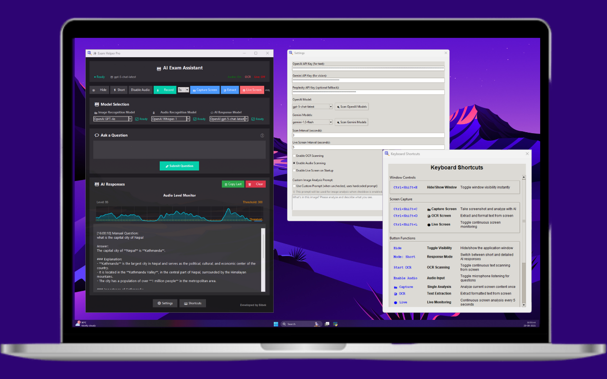

# Exam Helper - AI-Powered Floating Assistant

A Python-based floating GUI application that works as an intelligent exam helper and personal assistant. The application captures questions from screen text (OCR) and audio input, then provides AI-powered answers using OpenAI's GPT models.

## 📸 Application Preview



*Modern, sleek interface with dark theme and intuitive controls*

## ✨ Key Highlights

- **🎨 Modern Dark UI**: Sleek, professional interface with smooth animations
- **🤖 Multi-AI Support**: OpenAI GPT, Google Gemini, and Perplexity integration
- **👻 Stealth Mode**: Invisible to screen sharing (Zoom, Teams, etc.)
- **📸 Smart Capture**: OCR, audio recording, and live screen monitoring
- **⚡ Real-time Processing**: Instant AI responses with progress indicators

## Features

### 🔍 Question Capture
- **Screen OCR**: Continuously scans the entire screen for text questions
- **Audio Input**: Captures questions from microphone input
- **Manual Input**: Text box for typing custom questions
- **Smart Detection**: Automatically identifies likely questions using heuristics

### 🤖 AI-Powered Answers
- **Dual AI Integration**: OpenAI for text, Perplexity for vision analysis
- **Perplexity Vision**: Advanced image analysis for screenshot-based questions
- **Response Modes**: Toggle between short/direct and detailed/explanatory answers
- **Question Analysis**: Automatically categorizes question types (math, definition, explanation, etc.)
- **Context Awareness**: Provides relevant and accurate answers

### 👻 Stealth Mode
- **Screen Sharing Protection**: Hides from screen capture applications (Zoom, Teams, etc.)
- **Always Visible**: Remains visible to the user while hidden from recordings
- **Transparency Control**: Adjustable window transparency
- **Click-through Mode**: Optional mouse event pass-through

### ⌨️ User Interface
- **Modern Dark Theme**: Professional appearance with smooth gradients
- **Floating Window**: Always-on-top, resizable interface (toggleable)
- **Model Selection**: Choose between different AI models for different tasks
- **Quick Toggle**: Ctrl+Shift+H hotkey to hide/show instantly
- **Screenshot Vision**: Ctrl+Shift+C hotkey for instant screenshot capture and AI analysis
- **Real-time Display**: Live answer updates with timestamps and status indicators
- **Settings Panel**: Easy configuration of API keys and preferences
- **Progress Tracking**: Visual feedback for all operations

## 🚀 Quick Start

### Option 1: Download Executable (Recommended)
1. Download the latest release from the releases page
2. Extract `ExamHelper.exe` from the zip file
3. Run `ExamHelper.exe` - no installation required!
4. Configure your API keys in the settings

### Option 2: Build from Source

#### Prerequisites
1. **Python 3.8+** installed on your system
2. **Tesseract OCR** for text recognition
3. **OpenAI API Key** for AI responses

### Step 1: Install Python Dependencies
```bash
python install_dependencies.py
```

Or manually install:
```bash
pip install -r requirements.txt
```

### Step 2: Install Tesseract OCR

**Windows:**
```bash
winget install UB-Mannheim.TesseractOCR
```
Or download from: https://github.com/UB-Mannheim/tesseract/wiki

**macOS:**
```bash
brew install tesseract
```

**Linux:**
```bash
sudo apt-get install tesseract-ocr
```

### Step 3: Configure API Keys
1. Run the application: `python exam_helper.py`
2. The application will create a `config.json` file automatically
3. Use the model selection dropdowns to choose your preferred AI models:
   - **Image Recognition**: OpenAI GPT-4o, Gemini Pro Vision, etc.
   - **Audio Recognition**: OpenAI Whisper, Gemini models
   - **AI Response**: OpenAI GPT models, Gemini Flash/Pro
4. Enter your API keys in the configuration file or through the interface
5. Adjust other preferences as needed

### 🔧 Building Executable

To create your own standalone executable:

```bash
# Method 1: Advanced build with progress tracking
python build_exe.py

# Method 2: Simple one-click build (takes long time with large application size)
build_simple.bat

# Method 3: Simple one-click build (takes less time with less application size)
build_optimize.bat

# Method 4: almost same time with same size application
build_executable.bat
build.bat

# Method 5: Manual PyInstaller
pyinstaller --onefile --windowed exam_helper.py
```


See `BUILD_GUIDE.md` for detailed build instructions.

## Usage

### Starting the Application
```bash
python exam_helper.py
```

### Basic Operations
1. **Automatic Scanning**: The app continuously scans for questions
2. **Manual Questions**: Type questions in the input box
3. **Screenshot Analysis**: Click "📸 Capture Screen" or press Ctrl+Shift+C
4. **View Answers**: Responses appear in the main display area
5. **Toggle Modes**: Switch between short and detailed answers
6. **Control Scanning**: Start/Stop OCR and Audio scanning independently
7. **Hide/Show**: Use Ctrl+Shift+H or the Hide button
8. **Always on Top**: Toggle to keep window above other applications

### Stealth Mode
- Automatically hides from most screen sharing applications
- Window remains visible to you but not in recordings
- Works with Zoom, Teams, Google Meet, Discord, and more

## Configuration

### Settings File: `config.json`
```json
{
  "openai_api_key": "your-api-key-here",
  "scan_interval": 3,
  "audio_enabled": true,
  "ocr_enabled": true,
  "response_mode": "short"
}
```

### Available Options
- **scan_interval**: Seconds between screen scans (default: 3)
- **audio_enabled**: Enable/disable microphone listening
- **ocr_enabled**: Enable/disable screen text capture
- **response_mode**: "short" for brief answers, "detailed" for explanations

## 📁 File Structure

```
exam_helper/
├── exam_helper.py          # Main application with modern GUI
├── ocr_module.py          # Screen text capture and OCR
├── audio_module.py        # Audio input and speech recognition
├── llm_module.py          # OpenAI API integration
├── gemini_module.py       # Google Gemini AI integration
├── perplexity_module.py   # Perplexity AI integration
├── stealth_module.py      # Stealth mode functionality
├── screenshot_module.py   # Screenshot capture utilities
├── config.json            # Configuration file (auto-generated)
├── requirements.txt       # Python dependencies
├── build_exe.py          # Advanced executable builder
├── build_simple.bat      # Simple build script
├── BUILD_GUIDE.md        # Detailed build instructions
├── preview.png           # Application screenshot
└── README.md             # This file
```

## Technical Details

### OCR Processing
- Uses Tesseract OCR with OpenCV preprocessing
- Applies noise reduction and image enhancement
- Filters out non-question text automatically

### Audio Processing
- Real-time speech recognition using Google Speech API
- Microphone calibration for ambient noise
- Voice activity detection to reduce false positives

### Stealth Implementation
- Uses Windows API calls to hide from screen capture
- SetWindowDisplayAffinity with WDA_EXCLUDEFROMCAPTURE
- Layered window attributes for transparency control

### AI Integration
- **Multi-Provider Support**: OpenAI GPT models, Google Gemini, Perplexity
- **Model Selection**: Choose optimal models for different tasks
- **Smart Routing**: Automatic model selection based on question type
- **Rate limiting**: Prevents API abuse and manages costs
- **Error handling**: Robust network and API error recovery
- **Status Indicators**: Real-time model availability and health checks

## Troubleshooting

### Common Issues

**"No OpenAI API key configured"**
- Add your API key in Settings
- Ensure the key has sufficient credits

**"Tesseract not found"**
- Install Tesseract OCR (see installation steps)
- On Windows, may need to set path manually in `ocr_module.py`

**"Microphone not working"**
- Check microphone permissions
- Ensure microphone is not used by other applications
- Try running as administrator

**"Stealth mode not working"**
- Run as administrator for full functionality
- Some screen capture apps may still detect the window
- Try adjusting transparency settings

### Performance Tips
- Increase scan_interval for better performance
- Disable audio or OCR if not needed
- Close other resource-intensive applications

## Security & Ethics

### Important Notes
- This tool is for educational assistance only
- Respect your institution's academic integrity policies
- Use responsibly and in accordance with exam rules
- The stealth feature should only be used where permitted

### Privacy
- Audio is processed locally and via Google Speech API
- Questions are sent to OpenAI for processing
- No data is stored permanently by the application
- Review OpenAI's privacy policy for their data handling

## Contributing

Feel free to contribute improvements:
1. Fork the repository
2. Create a feature branch
3. Make your changes
4. Submit a pull request

## License

This project is for educational purposes. Please use responsibly and in accordance with your institution's policies.

## Support

For issues or questions:
1. Check the troubleshooting section
2. Review the logs in `exam_helper.log`
3. Ensure all dependencies are properly installed
4. Verify your OpenAI API key is valid and has credits